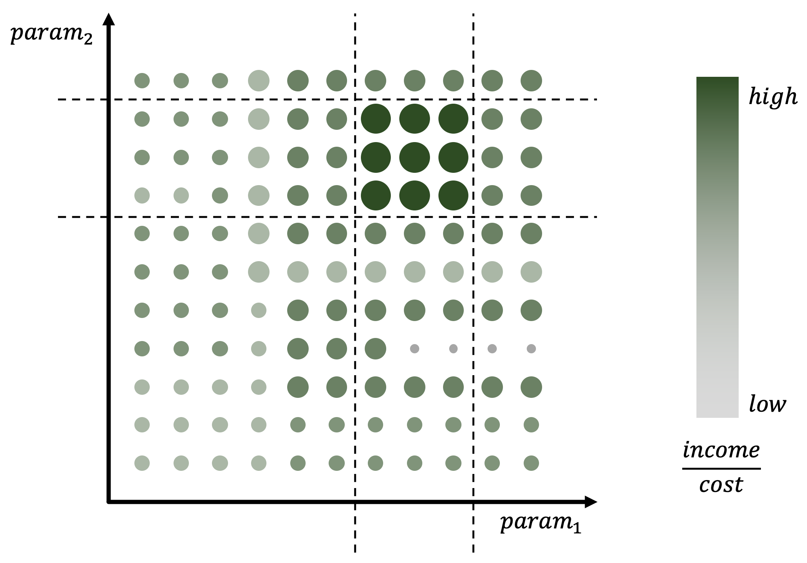
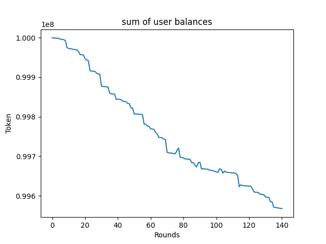
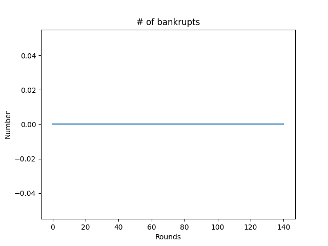
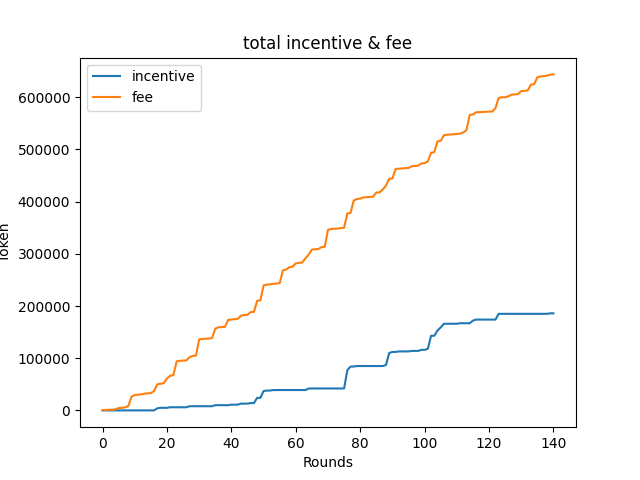

# tava-simulator
Simulator for finding the best hyperparameters of Tava

## What is the best hyperparameter



A hyperparameter is a parameter whose value is given by nature and used to control the system process. 

In this simulator, user can change some hyperparameter(s) in the Tava system and track metric(s)
* like income per cost
* to find best hyperparameters that makes output of metric(s) high (or low) .

# How to use

## Help
```
python src/main.py -h
```
```
usage: main.py [-h] [--fee F] [--additional A] [--time T] [--active P]
               [--missing M] [--users U] [--round R] [--balance B]
               [--mechanism S] [--coef C] [--power X] [--exp E]

Hyperparameters

optional arguments:
  -h, --help      show this help message and exit
  --fee F         default rent fee
  --additional A  additional fee per 1h
  --balance B     default balance
  --time T        default rent time
  --active P      active ratio
  --missing M     missing ratio
  --users U       number of users
  --round R       number of rounds (h)
  --mechanism S   incentive system (0: linear, 1: power, 2: exponential)
  --coef C        incentive coef.
  --power X       incentive power
  --exp E         incentive exp.
```

More details here: [arguments.py](./src/arguments.py)

## Example
```
python src/main.py --round=2000 --users=200 --time=2
```

## Logs
Logs will be saved in `./logs` after executing `./src/main.py` or `run.sh`.
* `run.sh` is the batch of `./src/main.py` with multiple (diff.) params.

# Visualization

## Help
```
python src/visualization.py -h
```
```
usage: visualization.py [-h] [--log L] [--show]

Name of log file

optional arguments:
  -h, --help  show this help message and exit
  --log L     name of log file
  --show      show figs
```

More details here: [visualization.py](./src/visualization.py)

## Example

```
python src/visualization.py --log="log_1591204931_mechanism_0.json" --show
```
```
> Setting: Namespace(log='log_1591204931_mechanism_0.json', show=True)
```





* TODO: auto save figs using logs in `./logs`.

# How it works

* `--users` is the number of users. Default value is 100.
* `--round` is the number of rounds. Default value is 1000.
    * `1 round = 1 hour` in simulation.
* `--balance` is the initial balance per user. Default value is `10**6`.
    * TODO: Applying Pareto distribution.

## Total fees
* if total_spent_time < `--time`: total_fees = `--fee`
* else: total_fees = (total_spent_time - `--time`) * `--additional` + `--fee`

## Random factors
* `--active` is the proportions of active users per round.
* `--missing` is the probability of missing a device(bike, etc.) per round.

## Mechanisms
| Number | Mechanism | Description | Notes |
| --- | --- | --- | --- |
| 0 | Linear | y = x * `--coef` | Default |
| 1 | Power | y = (x ** `--power`) * `--coef` | - |
| 2 | Exp. | y = (`--exp` ** x) * `--coef` | - |

More details here: [mechanisms.py](./src/mechanisms.py)
